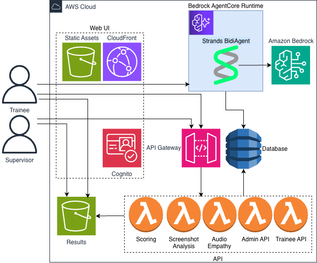
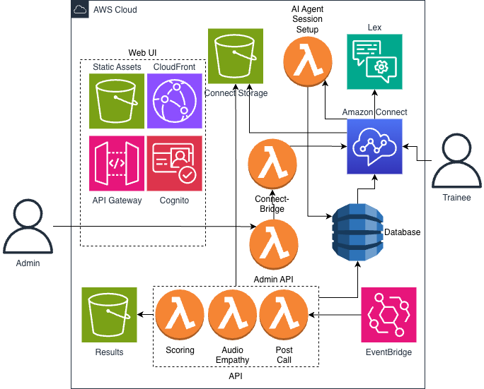
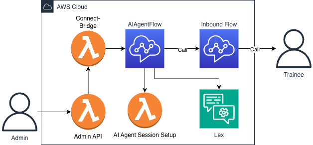

# Call Center Training Agent

AI-powered voice training system for call center agents using Amazon Nova 2 Sonic. Deploy as a standalone web application or integrate with Amazon Connect AI Agents for realistic customer simulations.

## Overview

This system simulates realistic customer interactions for training call center agents. An AI customer (powered by Nova 2 Sonic) engages trainees in real-time voice conversations based on configurable scenarios drawn from real call logs. Sessions are recorded (stereo WAV + transcript) and automatically scored against a detailed rubric using Claude.

Two deployment modes are supported:
- **Web UI** — Browser-based training via CloudFront, with Cognito authentication and role-based access (trainee/admin)
- **Amazon Connect** — Phone-based training where trainees call in and interact with the AI customer through Amazon Connect contact flows

Multilingual support covers English, French, Italian, German, Spanish, Portuguese, and Hindi via Nova 2 Sonic voices.

## Architecture

### Web UI



Trainees and supervisors access the React frontend via CloudFront. Voice streams flow directly to Bedrock AgentCore Runtime (Strands BidiAgent). API Gateway backed by Lambda functions handles scenarios, sessions, scoring, screen analysis, and audio empathy evaluation. Cognito provides authentication with admin and trainee roles.

### Amazon Connect



Admins initiate training calls through the web UI. Amazon Connect places an outbound call to the trainee using AI Agents for natural conversation. The AI Agent Session Setup Lambda injects scenario data before the conversation starts. Post-call analysis runs scoring and audio empathy evaluation automatically.

All Amazon Connect configuration (AI Agents, prompts, contact flows, security profiles) is managed through the Amazon Connect console.

### Connect Flow



The Admin API triggers an outbound call via Connect. The contact flow invokes the Session Setup Lambda to inject scenario data, then routes to the AI Agent block for conversation. Amazon Connect handles speech recognition and synthesis automatically.

## Features

- **Real-time voice conversations** with AI customers via Nova 2 Sonic bidirectional streaming
- **Configurable customer voices, moods, and languages** — choose from 16 Nova 2 Sonic voices across 7 languages
- **Scenario library** with real call log-based scenarios across multiple insurance carriers
- **Automated scoring** against a detailed rubric covering security, compliance, communication, and knowledge
- **Screen recording analysis** — capture and analyze agent screen activity during sessions
- **Audio empathy analysis** — evaluate tone and emotional intelligence from audio
- **Admin dashboard** for supervisors to manage scenarios, review sessions, and configure scoring criteria
- **Session history** with full transcripts, audio playback, and score breakdowns
- **Duo mode** — multi-character training scenarios with natural handoffs (Web UI only, not supported in Amazon Connect)

## Prerequisites

- AWS account with Bedrock access (Nova 2 Sonic + Claude models enabled)
- Python 3.13+
- Node.js 18+ and npm
- AWS CDK CLI (`npm install -g aws-cdk`)
- Docker (for building Lambda container images)
- AWS CLI configured with appropriate credentials

## Deployment

### First-time setup

Install dependencies (required before first deployment):

```bash
cd deployment && npm install          # CDK infrastructure
cd ../frontend/app && npm install     # Web UI (needed for --webui or --all)
cd ../../connect-admin/app && npm install  # Connect Admin UI (needed for --connect or --all)
```

Bootstrap CDK in your target account/region (only needed once):

```bash
cd deployment
cdk bootstrap aws://ACCOUNT_ID/us-west-2 --profile YOUR_PROFILE
```

### Choose your deployment mode

**Option 1: Web UI** — Browser-based training with CloudFront and Cognito

```bash
./deployment/deploy.sh --webui
```

**Option 2: Amazon Connect** — Phone-based training via Amazon Connect AI Agents

See [docs/CONNECT_GUIDE.md](docs/CONNECT_GUIDE.md) for complete setup and deployment instructions.

### Deploy a single stack

```bash
cd deployment && npm run build && cdk deploy CallCenterTraining-Core --require-approval never --context deployMode=all --profile YOUR_PROFILE --region us-west-2
```

Stack names: `CallCenterTraining-Core`, `CallCenterTraining-Web`, `CallCenterTraining-Connect`

## Usage

### Web UI

1. Log in with Cognito credentials (created by admin via `deployment/create-user.sh` or AWS Console)
2. Select a training scenario, customer voice, mood, and language
3. Start the session — speak naturally via your microphone
4. End the session when the conversation is complete
5. View automated scoring results with detailed feedback

### Amazon Connect

1. Admin selects a scenario and initiates a training call from the web UI
2. Trainee receives a phone call from Amazon Connect
3. AI customer engages in a natural voice conversation
4. Post-call scoring runs automatically
5. Admin reviews results in the dashboard

## User Roles

The Web UI uses Cognito groups for role-based access:

| Role | Group | Capabilities |
|------|-------|-------------|
| **Trainee** | `trainee` | Select scenarios, start training sessions, view own scores |
| **Admin** | `admin` | All trainee capabilities + manage scenarios, view all trainees' sessions/scores/recordings, configure scoring criteria |

Users without a group default to trainee access.

### Creating users and assigning roles

```bash
# Create a user
cd deployment
./create-user.sh user@example.com Password123!

# Assign to admin group
./create-user.sh user@example.com Password123! --group admin

# Assign to trainee group (explicit)
./create-user.sh user@example.com Password123! --group trainee
```

## Creating Scenarios

Scenarios are JSON files in `scenarios/`. Each scenario includes customer context, key challenges, success criteria, and an initial message derived from real call logs.

Seed all scenarios to DynamoDB:

```bash
python scripts/seed_scenarios.py
```

See existing scenarios in `scenarios/` for the expected JSON format.
